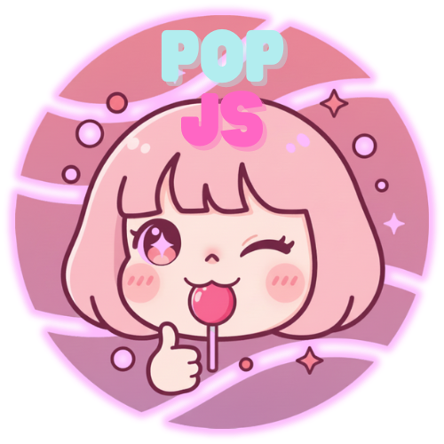
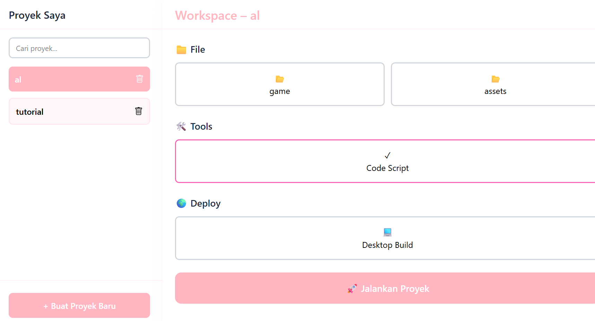
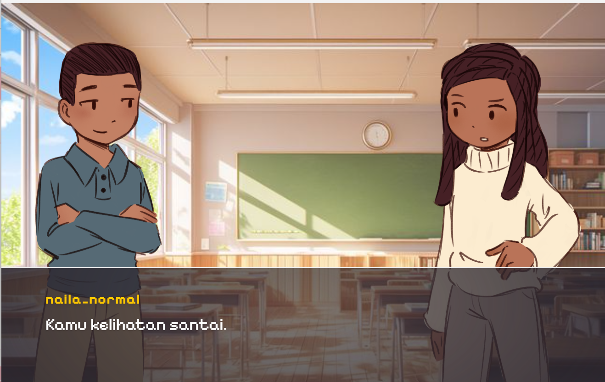

# 🎭 My Custom Visual Novel Engine

Sebuah engine Visual Novel mandiri yang dirancang khusus untuk kenyamanan pengembangan (developer experience). Engine ini terinspirasi dari gaya kerja **Ren'Py** namun dioptimalkan dengan konsep yang lebih sederhana agar saya bisa mengembangkan berbagai proyek game ke depannya dengan lebih cepat dan efisien.

## ✨ Visi Proyek
Tujuan utama dari engine ini adalah menciptakan **lingkungan pengembangan yang "enak"**. Saya ingin fokus pada cerita dan aset tanpa harus terhambat oleh kompleksitas teknis yang berlebihan, sambil tetap mempertahankan fleksibilitas untuk kustomisasi fitur.

## 🚀 Fitur Utama
* **Simple Syntax:** Terinspirasi dari Ren'Py untuk penulisan dialog dan kontrol alur cerita.
* **Modular Design:** Struktur kode yang memudahkan saya untuk "copy-paste" dan modifikasi untuk proyek game baru.
* **Efficient Asset Management:** Pengaturan gambar, musik, dan efek yang tertata rapi.
* **Personal Workflow:** Disesuaikan dengan cara saya berpikir dan bekerja sebagai pengembang.

## 🛠️ Struktur Folder (src)
- `assets/` : Tempat menyimpan semua aset visual (seperti `pop.png`) dan audio.
- `core/` : Logika utama engine (rendering dialog, transisi, dsb).
- `scripts/` : Tempat menulis skenario cerita game.

## 📂 Cara Penggunaan
*(Isi bagian ini nanti dengan langkah singkat cara menjalankan engine-mu)*
1. Clone repository ini.
2. Install dependencies.
3. Jalankan perintah `npm start`

## 📂 Preview & Development
Berikut adalah tampilan alat (tools) dan lingkungan pengembangan yang sedang saya bangun:

  
  

> **Note:** Gambar di atas menunjukkan progres sistem `tool.png` dan lingkungan kerja `dev1.png` yang saya gunakan untuk memonitor alur cerita di **POP Engine**

---
*Dibuat dengan ❤️ untuk kemudahan pengembangan game masa depan.*
